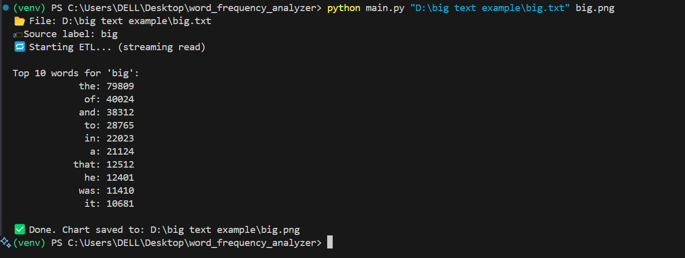
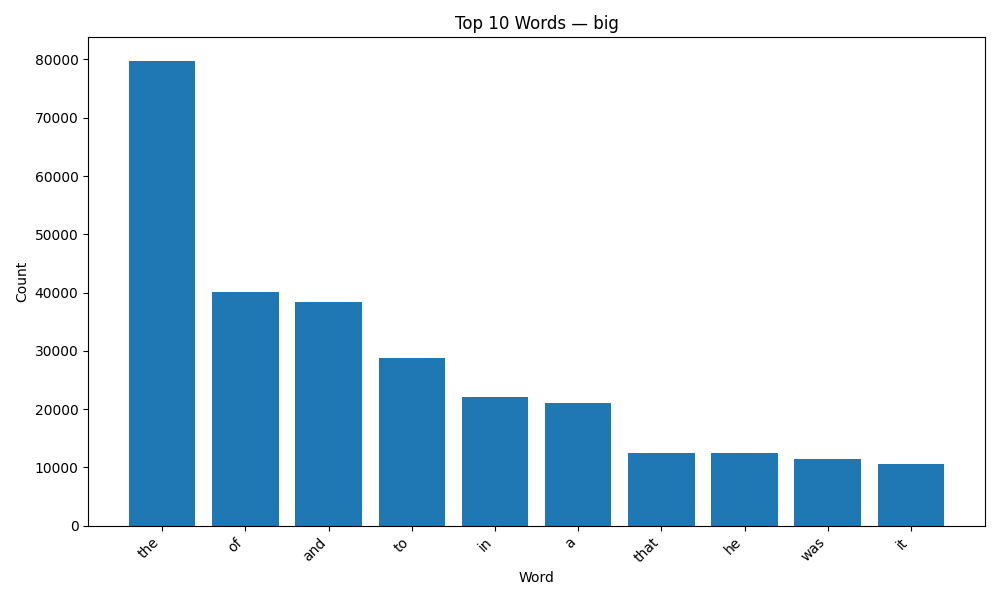
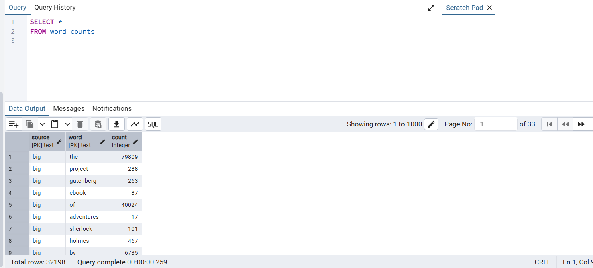
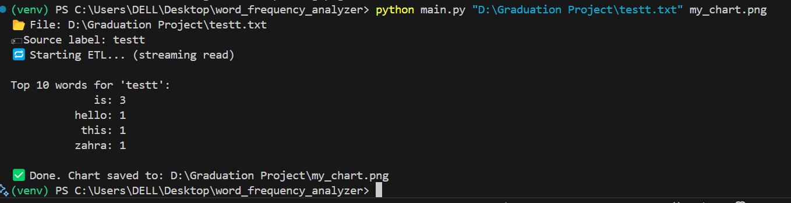
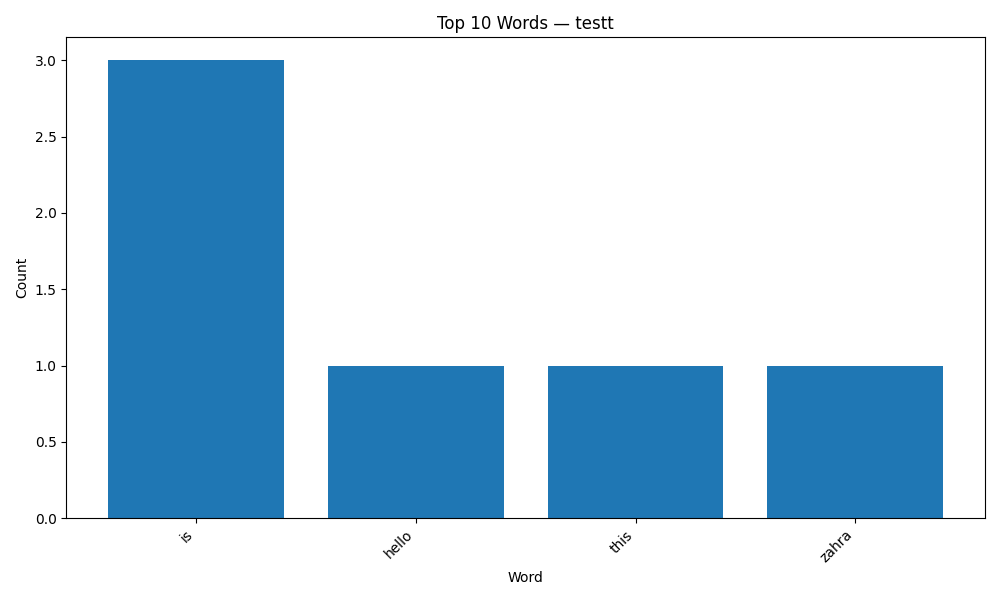
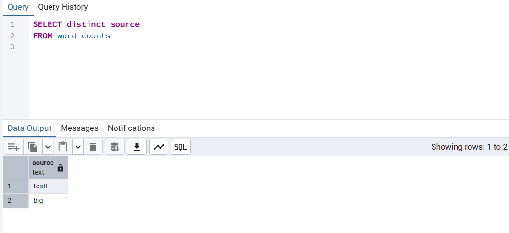

# Word Frequency Analyzer with PostgreSQL & Docker

## 1. Project Overview
This project is an **ETL (Extract – Transform – Load)** pipeline that processes large text files, analyzes word frequencies, stores the results in a PostgreSQL database, and visualizes the data as a PNG chart.

It is designed to:
- Handle large text files without loading everything into memory at once (**streaming read**).
- Store processed data in a relational database for easy querying and future analysis.
- Provide a visual representation (**bar chart**) of the most frequent words.

**Problem it solves:**  
Many text analytics projects face challenges with memory usage, data storage, and analysis repeatability.  
This project addresses these by:
- Reading files line-by-line instead of fully in memory.
- Storing results in PostgreSQL for durability and query flexibility.
- Generating visual reports automatically for quick insights.

---

## 2. Workflow

### Step 1 – Extract
- The program reads the text file path from the command line.
- Uses streaming read to process very large files efficiently.

### Step 2 – Transform
- Cleans the text (removing punctuation, converting to lowercase).
- Splits text into words.
- Counts the frequency of each unique word.

### Step 3 – Load
- Connects to PostgreSQL using `psycopg2`.
- Creates a table (if not exists) to store results.
- Inserts word frequencies into the database.

### Step 4 – Visualization
- Generates a PNG bar chart showing the top **N** most frequent words using `matplotlib`.

### Step 5 – Verification
- You can use **pgAdmin** (via browser) to inspect the stored data in PostgreSQL.

---

## 3. Tools Used and Why

| Tool           | Purpose                                  | Why chosen |
|----------------|------------------------------------------|------------|
| Python         | Core programming language for ETL        | Versatile, strong ecosystem for data processing |
| psycopg2       | PostgreSQL database connector            | Reliable and widely used for Python–PostgreSQL integration |
| matplotlib     | Chart generation                         | Easy and flexible for producing high-quality plots |
| Docker         | Containerization for PostgreSQL & pgAdmin| Ensures same environment on all machines |
| PostgreSQL     | Relational database to store word counts | Robust, SQL-based, scalable |
| pgAdmin        | GUI to view and manage PostgreSQL        | Makes it easy to inspect tables and debug data |
| Docker Compose | Multi-container orchestration            | Simplifies starting PostgreSQL & pgAdmin together |

---

## 4. How to Run This Project

### Prerequisites
- **Docker** installed  
- **Python 3.8+** installed  

---

### 1. Clone the Repository
```bash
git clone https://github.com/yourusername/word_frequency_analyzer.git
cd word_frequency_analyzer
```
### 2.  Start the Database Services
```bash
docker-compose up -d
```
This starts:
- PostgreSQL on port 5432 (username: myuser, password: mypassword)
- pgAdmin on port 5050 (email: admin@admin.com, password: admin)
  
### 3. Install Python Dependencies
```bash
pip install -r requirements.txt
```

### 4. Run the Project
``` bash
python main.py "path/to/your/file.txt" output.png
```
ex: python main.py "D:/big text example/big.txt" big.png

### 5. View the Results
- Database: Visit http://localhost:5050, log in to pgAdmin, and query the word_counts table.
- Chart: Open the generated PNG file (same path as the txt file).

---

# Sample Run

### 1. Added a file path then the name of the PNG output



### 2. Chart result



### 3. Data on postgresql




---
# Small file example, diffrent path
### 1. Added the path



### 2. Chart result



### 3. Updated database with the new file ( named testt)




---
# Conclusion

This project provides a modular ETL framework for efficiently processing large text files. I hope it serves as a solid foundation for learning and building ETL pipelines.

Thank you for reviewing my work!
I’m happy to hear any suggestions or improvements you may have.


